# Splunk Windows Login Analysis Home Lab

## Project Overview

This project is a beginner-friendly SOC Analyst home lab using Splunk Enterprise to collect and analyze Windows Security Event Logs from a Windows Server domain controller.

The goal of this project was to simulate common authentication activity that a SOC Tier 1 analyst might investigate, including successful logins, failed login attempts, and multiple failed logins followed by a successful login.

This lab was built as part of my cybersecurity portfolio to demonstrate basic SIEM, log analysis, and Windows authentication investigation skills.

---

## Lab Environment

| Component       | Description                           |
| --------------- | ------------------------------------- |
| Host System     | Windows PC running Oracle VirtualBox  |
| Virtual Machine | Windows Server 2022 Domain Controller |
| Domain          | HOMELAB                               |
| Hostname        | DC01                                  |
| SIEM Tool       | Splunk Enterprise                     |
| Log Source      | Windows Security Event Logs           |

---

## Tools Used

* Splunk Enterprise
* Windows Server 2022
* Windows Event Viewer / Windows Security Logs
* Oracle VirtualBox
* Active Directory Domain Services

---

## Project Objectives

* Install and access Splunk Enterprise.
* Ingest Windows Event Logs into Splunk.
* Search Windows Security logs using SPL.
* Identify successful login events.
* Identify failed login events.
* Simulate multiple failed login attempts.
* Investigate failed logins followed by a successful login.
* Document findings with screenshots and searches.

---

## Windows Event IDs Analyzed

| Event ID | Description      | Why It Matters                                                                            |
| -------- | ---------------- | ----------------------------------------------------------------------------------------- |
| 4624     | Successful logon | Shows when an account successfully logs into the system                                   |
| 4625     | Failed logon     | Shows failed login attempts, which may indicate password guessing or brute-force activity |
| 4634     | Logoff           | Shows when a user session ends                                                            |

The main focus of this project was Event ID 4624 and Event ID 4625.

---

Screenshots
1. Splunk Installed and Running
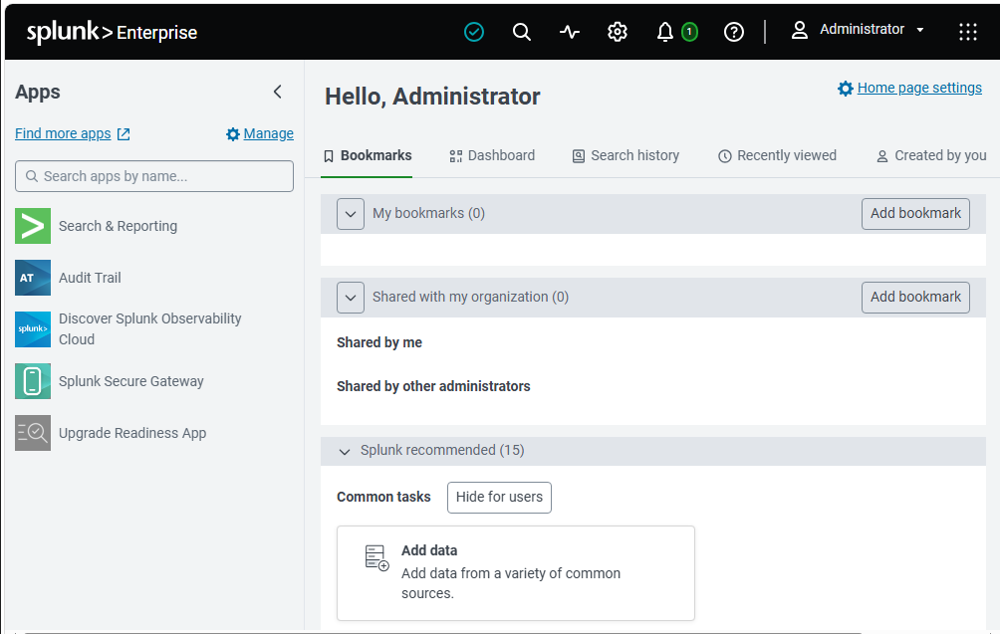


This screenshot shows that Splunk Enterprise was successfully installed and accessible through the web interface.

2. Add Windows Event Logs
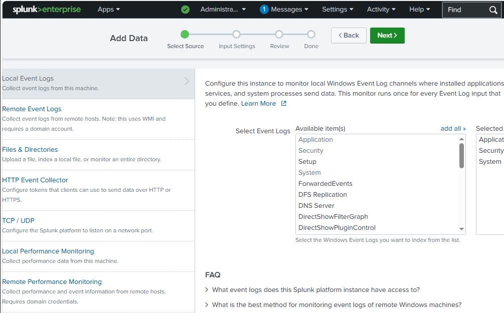


This screenshot shows the Windows Event Log source selection page in Splunk.

3. Windows Event Log Input Configuration
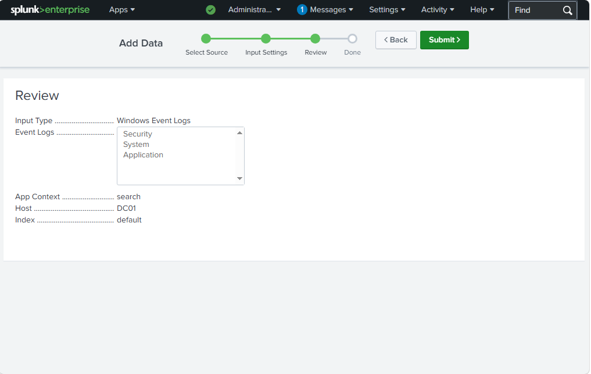


This screenshot shows the Windows Event Logs selected for ingestion, including Security, System, and Application logs.

4. Windows Event Log Input Success
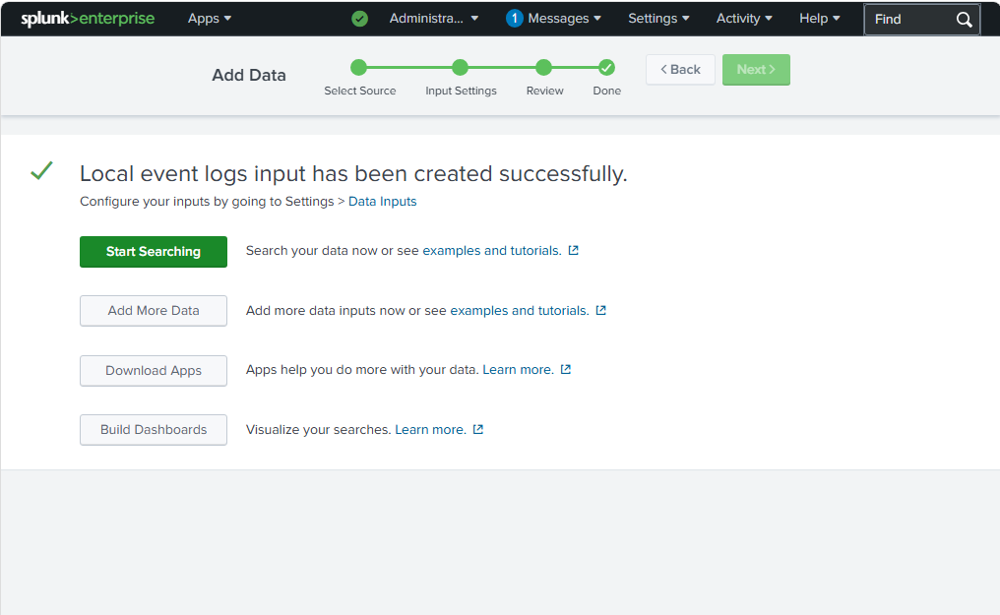


This confirms that the local Windows Event Log input was created successfully.

5. Windows Security Logs Ingested
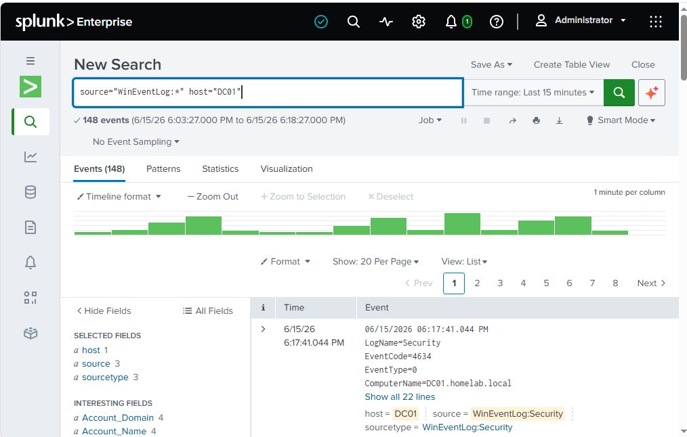


This confirms that Splunk successfully ingested Windows Security Event Logs from host DC01.

6. Successful Login Events
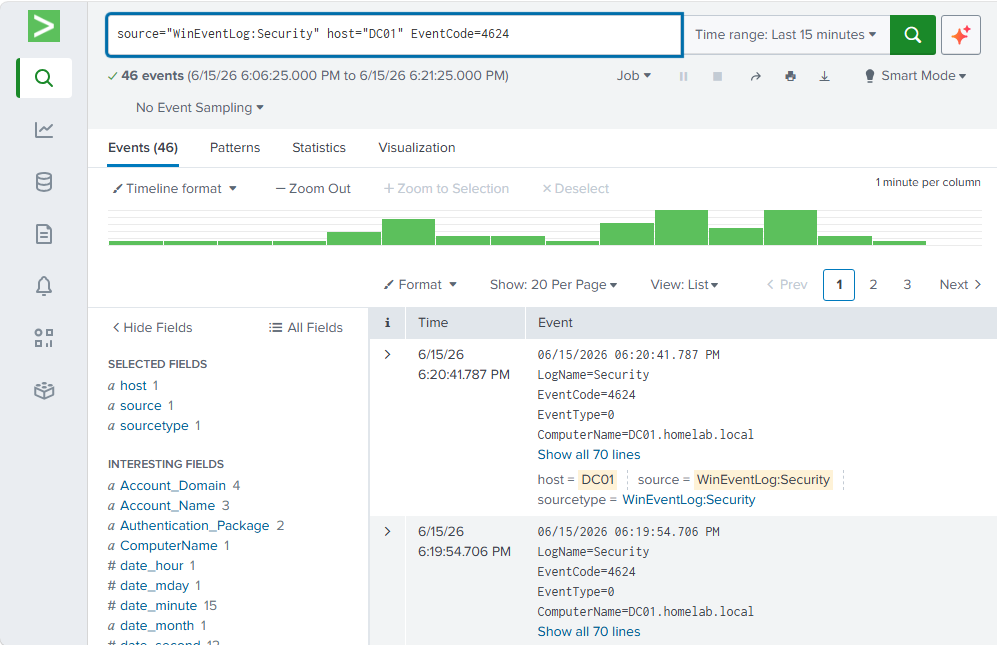


This search identified successful Windows login events using Event ID 4624.

7. Failed Login Events


This search identified failed Windows login attempts using Event ID 4625.

8. Authentication Timeline
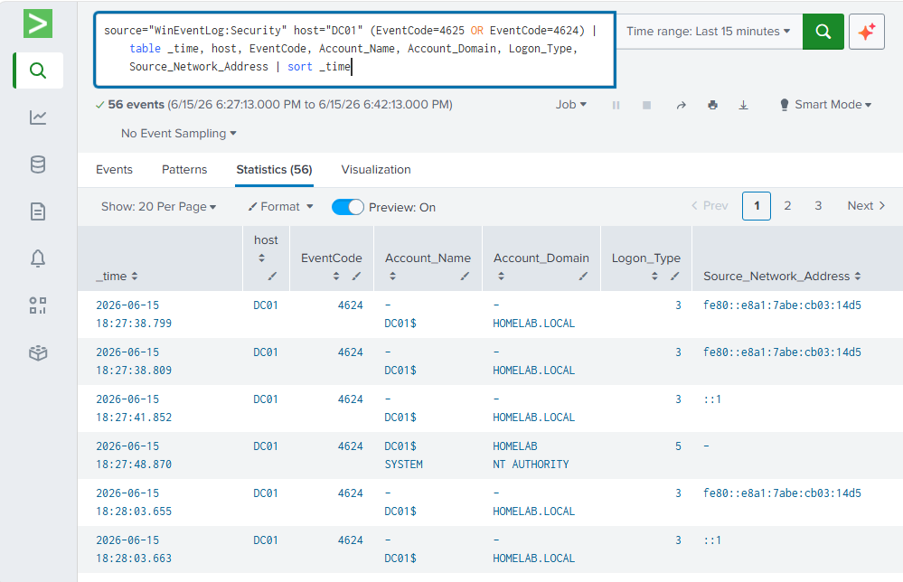


This table shows Windows authentication events in a cleaner timeline format.

9. Failed Logins Followed by Successful Login
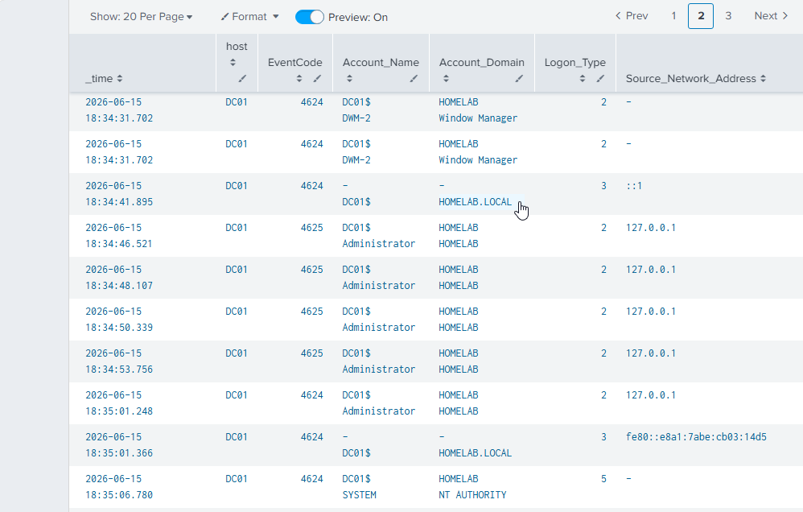


This timeline shows multiple failed login attempts followed by a successful login, which is a common pattern SOC analysts may investigate.

10. Multiple Failed Login Detection
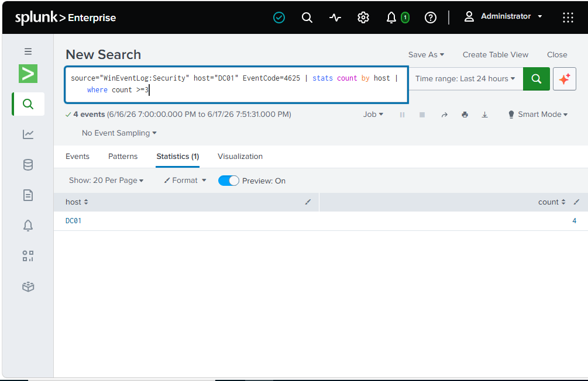


This detection search summarized failed login activity and showed that DC01 had multiple failed login events.

11. Failed Logins by Account
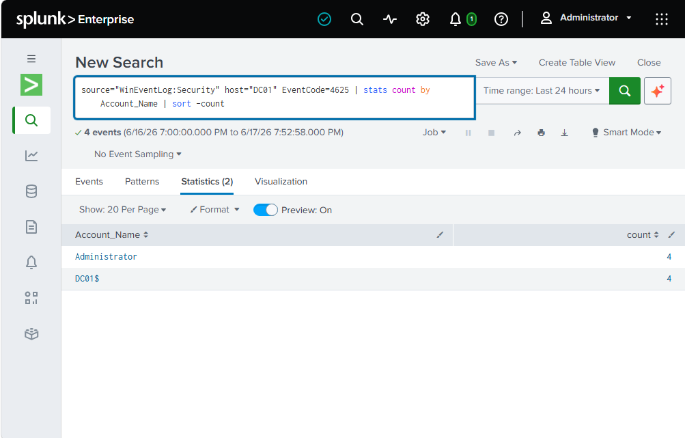


This search grouped failed login attempts by account name to identify which account was involved.

12. Final Administrator Login Investigation
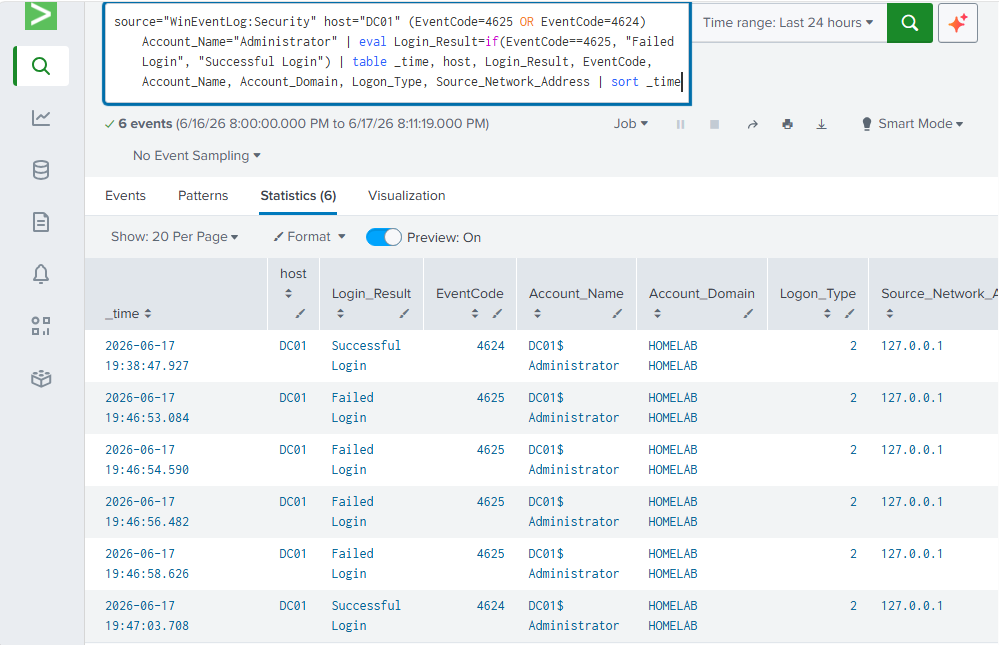


This final investigation view shows failed Administrator login attempts followed by a successful login.

---

## Splunk Searches Used

### Search All Windows Security Events

```spl
source="WinEventLog:Security" host="DC01"
```

### Search Successful Logins

```spl
source="WinEventLog:Security" host="DC01" EventCode=4624
```

### Search Failed Logins

```spl
source="WinEventLog:Security" host="DC01" EventCode=4625
```

### Authentication Timeline

```spl
source="WinEventLog:Security" host="DC01" (EventCode=4625 OR EventCode=4624)
| table _time, host, EventCode, Account_Name, Account_Domain, Logon_Type, Source_Network_Address
| sort _time
```

### Count Failed Logins by Host

```spl
source="WinEventLog:Security" host="DC01" EventCode=4625
| stats count by host
| where count >= 3
```

### Count Failed Logins by Account

```spl
source="WinEventLog:Security" host="DC01" EventCode=4625
| stats count by Account_Name
| sort -count
```

### Final Administrator Login Investigation

```spl
source="WinEventLog:Security" host="DC01" (EventCode=4625 OR EventCode=4624) Account_Name="Administrator"
| eval Login_Result=if(EventCode==4625, "Failed Login", "Successful Login")
| table _time, host, Login_Result, EventCode, Account_Name, Account_Domain, Logon_Type, Source_Network_Address
| sort _time
```

---

## Investigation Summary

During the lab, I simulated multiple failed login attempts against the Administrator account on the Windows Server domain controller. Splunk recorded these failed login attempts as Windows Security Event ID 4625.

After the failed attempts, a successful Administrator login was recorded as Event ID 4624. This created a realistic investigation scenario where multiple failed logins were followed by a successful login.

In a real SOC environment, this type of activity could represent a user mistyping a password, but it could also indicate password guessing, brute-force activity, or unauthorized access attempts. A SOC analyst would review the account name, source address, host, timestamp, and surrounding authentication events to determine whether the activity is suspicious.

---

## Key Findings

* Splunk successfully ingested Windows Security Event Logs from DC01.
* Successful login events were identified using Event ID 4624.
* Failed login events were identified using Event ID 4625.
* Multiple failed Administrator login attempts were observed.
* A successful Administrator login occurred after the failed attempts.
* SPL searches were used to summarize and investigate the authentication activity.

---

## What I Learned

* How a SIEM collects and searches log data.
* How Windows authentication events appear in Security logs.
* How to use basic SPL searches in Splunk.
* How to identify failed and successful login events.
* How to investigate suspicious login patterns.
* How to document a security investigation for a portfolio project.

---

## Future Improvements

* Add Splunk Universal Forwarder on a Windows client VM.
* Forward logs from Client01 to the Splunk server.
* Create a Splunk dashboard for authentication monitoring.
* Add alerting for multiple failed login attempts.
* Expand analysis to include account lockouts and privilege-related events.
